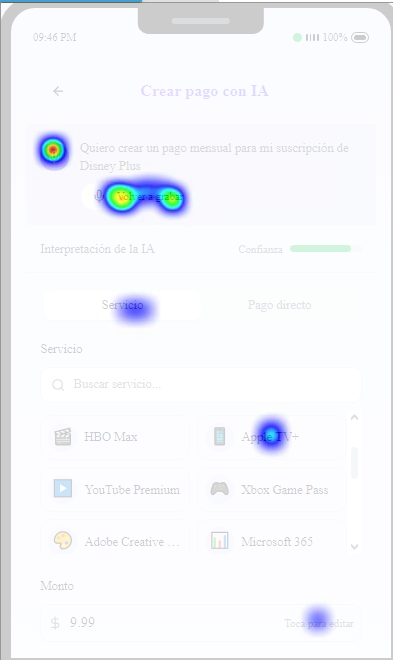

# Caso 1: Payment Assistant

Imagina un asistente personal que no solo recuerda tus pagos recurrentes, sino que también los ejecuta por ti con solo confirmar un recordatorio. Con tecnología de inteligencia artificial de vanguardia, nuestra app te permite registrar y programar pagos de servicios como luz, agua, renta y más, usando simplemente tu voz. Olvídate de fechas vencidas, multas o estrés financiero. Además, con planes flexibles que se adaptan a tus necesidades, disfrutas de una experiencia gratuita para un pago mensual y opciones premium para múltiples transacciones.

### Goal Diagram

Fuentes de informacion para la realizacion del goal map:
 - https://www.thefamiliar.tech/blog/2020-12-03-mapping-the-design-sprint-unpacked
 - https://designsprintkit.withgoogle.com/methodology/overview

### Puntos mas Valiosos del Sistema:

Haciendo una revision del diagrama se determino que los puntos mas valiosos del diagrama son los siguientes:
- Landing 
    
- Crear Nuevo Pago
    
- Seleccionar Servicio
    
- Agregar Metodo de Pago
  
- Refinamiento de Prompt
    Para este punto no hay una imagen en especifico del diagrama, pero se considera que es un punto importante ya que es la manera principal en la cual los usuarios crean nuevos pagos.

### Wireframes:
Los siguientes wireframes es un vistaso general a la represntacion de la estructura y disposición de las pantallas clave de la aplicación, enfocadas en el flujo de preoridad de la aplicacion.

De los wireframes destacan ventanas en particular las cuales son las mas valiosas del sistema

### Home page 

### Crear Nuevo Pago

### Seleccionar Servicio

### Agregar Metodo de Pago
  
### Prompt
  

Estos wireframes servirán como base para la creacion del diseño de las ventanas en un futuro, asegurando que la aplicacion cumpla con las necesidades del usuarios.

### Wirefrmaes generados por AI:

Para este apartado se utilizo [Vercel](https://v0.dev) para generar y hacer un deploy de las pantallas generadas.

- https://v0.dev/chat/fork-of-payment-assistant-app-8Ma3SWdI6Rt?b=b_1mc30iXeKoM

### Tests de Usabilidad:

Para las pruebas de usabilidad, se decidió utilizar imágenes estáticas de las pantallas generadas con inteligencia artificial. Esta elección se debe a que, al usar el enlace del deployment, han surgido problemas al visualizar el heatmap correctamente.

El video de cada participante se puede encontrar [AQUI](https://estudianteccr-my.sharepoint.com/:f:/g/personal/salazard_estudiantec_cr/EqnIbTOnreBMkvLA-SQaN2ABu_kOKF-pligxiGw7koSbwA?e=ZxbMel)

En general la mayoria de participantes lograron cumplir los objetivos de la prueba correctamente.  

A continuacion se presentan los Heatmaps de cada task.

### Heatmap Agregar Nuevo Metodo Pago 1

### Heatmap Agregar Nuevo Metodo Pago 2

### Heatmap Crear nuevo pago con voz

### Heatmap Volver a tomar la nota de voz

### Heatmap Seleccionar un servicio

### Comentarios adicionales de los participantes
